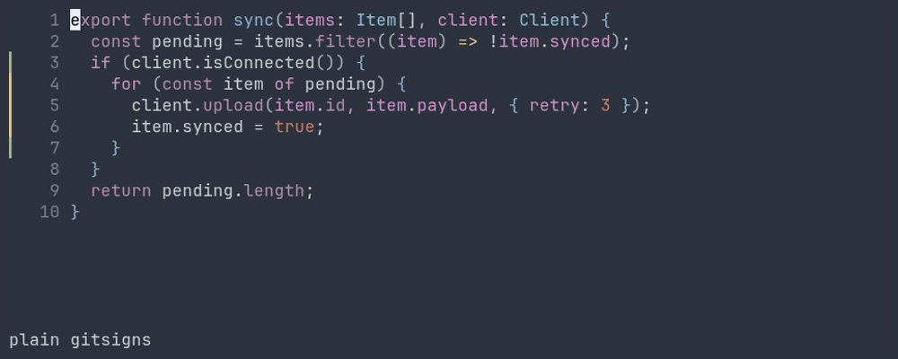

# difftsigns.nvim

Dims the formatting noise in your gitsigns gutter so that the real changes stand
out.

You reindent a block, run prettier, or wrap something in a conditional. gitsigns
lights up twelve lines, two of which actually changed.

difftsigns asks [difftastic](https://github.com/Wilfred/difftastic) which of
those lines changed *structurally* and dims the rest, in the same column, with
the same glyphs, using your existing `]c` navigation.



One gutter column, your bindings, only the colour changes.

If you want a difftastic viewer, a side-by-side or pager-style window that you
open on demand, that already exists:
[difftastic.nvim](https://github.com/clabby/difftastic.nvim) and
[difft.nvim](https://github.com/ahkohd/difft.nvim). difftsigns is not a view. It
annotates the buffer you are already editing, and only through gitsigns.

## Requirements

- Neovim 0.11+
- [gitsigns.nvim](https://github.com/lewis6991/gitsigns.nvim), required, not
  optional (see [How it works](#how-it-works))
- [difftastic](https://github.com/Wilfred/difftastic) 0.70 or 0.71 on `PATH`

## Install

```lua
-- lazy.nvim
{
  "janbuchar/difftsigns.nvim",
  dependencies = { "lewis6991/gitsigns.nvim" },
  opts = {},
}
```

That's all. You don't need to touch `signcolumn`, because the column belongs to
gitsigns.

## Configuration

Defaults shown, all keys optional.

```lua
require("difftsigns").setup({
  difft_cmd      = "difft",       -- path to, or wrapper around, difftastic
  debounce_ms    = 400,           -- difft runs at roughly this cost on a large file
  max_filesize   = 1024 * 1024,   -- matches difft's own --byte-limit
  noise_hl       = "DifftSignsNoise",  -- highlight for demoted cells
  noise_text     = nil,           -- nil = mirror gitsigns' glyph; set a string to override
  priority_offset = 1,            -- added to gitsigns' sign_priority to win the cell
  graph_limit    = nil,           -- difft --graph-limit; nil = difft's default (3,000,000)
  language_overrides = {},        -- { ["*.foo"] = "javascript" }
  difft_versions = { "0.70.0", "0.71.0" },  -- validated; others warn, {} = no check
  on_attach = function(bufnr) end,
})
```

### graph_limit, or why does it do nothing on this file

difftastic gives up on the structural diff once its internal graph exceeds
`--graph-limit` vertices and returns a line diff instead. difftsigns refuses to
render that, since it would mark every token on every changed line, spaces
included. You get plain gitsigns and `:DifftSigns status` tells you so.

Measured on a 708-line TypeScript test file with around 50 changed lines:

| `graph_limit` | outcome | time |
|---|---|---|
| 100,000 | gave up | 0.4 s |
| 1,000,000 | gave up | 2.6 s |
| 3,000,000 (difft default) | gave up | 7.9 s |
| 5,000,000 | structural diff | 7.7 s |

At the default, difftastic spends eight seconds and then tells you nothing.
Raising the limit buys real answers on heavily changed files for no more time
than failing slowly cost, at the price of peak memory. Lowering it makes
hopeless cases fail fast and cheap.

### Highlight groups

| Group | Default | Purpose |
|---|---|---|
| `DifftSignsNoise` | links `NonText` | demoted (formatting-only) gutter cells |
| `DifftSignsAdded` | links `Added` | the preview's `+` sign marker (green) |
| `DifftSignsRemoved` | links `Removed` | the preview's `-` sign marker (red) |
| `DifftSignsAddedBg` | links `DiffAdd` | added-token background in the preview |
| `DifftSignsRemovedBg` | links `DiffDelete` | removed-token background in the preview |
| `DifftSignsContext` | links `Comment` | reflow-only lines in the preview |

The markers link `Added` and `Removed` because `DiffAdd` and `DiffDelete` are
background-only in most colourschemes, which is what the token backgrounds want
and what a sign glyph can't use.

`DifftSignsNoise` is the entire visual design of the plugin. If the dimming is
too subtle or too strong in your colourscheme, that's the knob.

## The preview

`require("difftsigns").preview()` shows the change under the cursor in gitsigns'
familiar shape, removed lines and then added lines, with two things gitsigns
can't show. The exact changed tokens are highlighted, the reflow-only lines are
dimmed, and a header quantifies the split.

The `-` and `+` markers live in the sign column, not inline, so the source keeps
its syntax colours and changed tokens get a red or green background behind them.

A one-sided change shows one side. If every token difftastic reported lives on
one side, the other side is dead weight, so it isn't printed and the header says
`· additions only` or `· deletions only`. In practice this collapses most hunks
by half:

```
git:                                    difftsigns:
-import type { IConcurrencySystem }     change @@ -7,1 +7,1 @@ · additions only
      from './concurrency_system.js';  +│ import type { ConcurrencyConsumer,
+import type { ConcurrencyConsumer,      │     IConcurrencySystem } from './...';
      IConcurrencySystem } from './...   ^^^^^^^^^^^^^^^^^^^ green background
```

A formatting-only hunk keeps both sides, because seeing the reflow is the point.

Only the changed tokens are washed, not the whole line. Lines that were only
reformatted stay dimmed, matching the gutter. A whole line is washed when there
are no tokens to prefer: a brand-new or deleted file, and lines that exist on
one side only.

The preview covers the whole run of adjacent hunks, and the header says how many
were merged, for example `add+change @@ -363,1 +363,6 @@ (2 hunks)`.

The float takes the room actually free above or below the hunk line, whichever
side has more. A hunk too tall for that has its remainder counted on the border
(`+23 more lines`), and the count follows the float's own scrolling once
focused.

Bind it instead of `gitsigns.preview_hunk`. Where difftsigns has no structural
verdict, such as an inert buffer or an unsupported language, it hands over to
gitsigns' preview:

```lua
vim.keymap.set("n", "<leader>hp", require("difftsigns").preview)
```

The float is transient and closes on the next cursor move or on `<Esc>`. A jump
is the exception — a `]c`, `[c`, a search or a `G` that lands on another hunk
re-shows it there, so hunk navigation keeps the preview without any binding
needing to know about it.

Calling `preview()` again focuses the float, the way gitsigns' `preview_hunk`
focuses its popup, which is how you scroll a hunk too tall for the screen. From
inside, `q` or `<Esc>` closes it.

## Commands

```
:DifftSigns preview    -- hunk preview with structural detail
:DifftSigns toggle     -- turn the overlay off to see plain gitsigns again
:DifftSigns refresh    -- force a re-diff
:DifftSigns status     -- report the noise/real split, or why there's no overlay
:DifftSigns attach | detach
```

Statusline component:

```lua
require("difftsigns").status()   -- "difft: 3 noise / 2 real", or nil
```

## How it works

difftsigns borrows all of its geometry:

| Thing | Source |
|---|---|
| Hunk boundaries | gitsigns |
| Reference text (the "before") | gitsigns |
| Base revision | gitsigns (follows its `change_base` automatically) |
| Sign glyphs and priority | gitsigns |
| Which lines *really* changed | difftastic |

For every gutter cell that gitsigns drew on a line difftastic considers
formatting noise, difftsigns places its own sign in the same cell at a higher
extmark priority, with gitsigns' glyph and a dim highlight. One column, one set
of shapes, one navigation model.

Two rules govern the whole plugin:

1. It subtracts emphasis and never adds it. It will never mark a line gitsigns
   left alone.
2. When in doubt, it does nothing, so a broken difftastic looks like an
   uninstalled plugin. If difftastic is missing, errors, times out, hits the
   size limit, or can't parse the language, you get plain, unmodified gitsigns.
   Run `:DifftSigns status` or `:checkhealth difftsigns` to find out why.

## What it catches, and what it doesn't

Verified against difftastic 0.70 and 0.71:

| Change | Result |
|---|---|
| Reindent / reformat | fully dimmed |
| Prettier-style rewrap (incl. added trailing comma) | fully dimmed |
| Wrap a block in `if` | new lines lit, reindented body dimmed |
| Variable rename | lit, exact tokens marked |
| Genuine deletion | lit |
| Removed blank lines | dimmed |
| Reindent + argument removed from a call | line stays lit, removed token marked |
| Reindent + value changed | line stays lit, changed token marked |
| Moved / reordered code | stays lit, difftastic has no move detection |

### Other limitations

- Staged hunks are not annotated, since gitsigns diffs those against a different
  base.
- Unsupported languages get nothing, because difftastic falls back to a line
  diff and that is not a structural verdict.
- Heavily changed files may exceed difftastic's graph limit and fall back the
  same way. See [`graph_limit`](#graph_limit-or-why-does-it-do-nothing-on-this-file).
- No staging. Use gitsigns'.
- Two of the four things read from gitsigns are internal APIs
  (`gitsigns.cache`, `gitsigns.hunks.calc_signs`). If a gitsigns update moves
  them, difftsigns goes inert and says so via `:checkhealth`.

## Development

```sh
make test   # plenary suite: fixtures, pure verdict join, screenstring gutter asserts, end-to-end
make demo   # re-render demo/demo.gif (needs docker)
```
